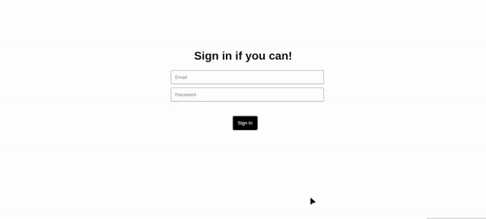
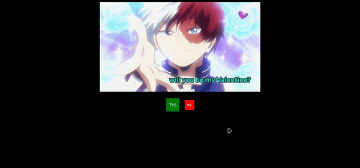

# button-will-react! (Prank Project)

Welcome to the "button-will-react" project, a harmless prank meant for fun and entertainment!

## Description

This project features a button that playfully moves away from your cursor when you hover over it, or do something that you didn't expect. It's a lighthearted experiment to showcase a interactive element using HTML, CSS, and JavaScript.

## Project Info

**1. Sign-in button**


- a untouchable sign-in button, even enter not gonna work , it will throw an alert.

Live preview - [Hit here!](https://iamovi.github.io/button-will-react/1-signin/)

**2. Propose**


- a untouchable no button, your partner have to choose yes.
- read README.txt from 2-propose folder for more details and improve it.

Live preview - [Hit here!](https://iamovi.github.io/button-will-react/2-propose/)

**3. Valentine**


- a fun way to propose your partner on 14th feb.

Live preview - [Hit here!](https://iamovi.github.io/button-will-react/3-valentine/)

## button-will-react with CDN

You can also use funny moving effect to your any custom button, Just follow few steps below -

```javascript
<script src="https://cdn.jsdelivr.net/gh/iamovi/button-will-react@cdn/dist/min/v1.0.0/move.min.js"></script>
```
- add this cdn to your project file.

And -
```html
<button class="button_will_react">Click Me!</button>
```
- just add class `button_will_react` to your button.

> That's it.

### Quick start with CDN

```html
<!DOCTYPE html>
<html lang="en">
<head>
    <meta charset="UTF-8">
    <meta name="viewport" content="width=device-width, initial-scale=1.0">
    <title>Document</title>
</head>
<body>

<!-- button-will-react-->
<button class="button_will_react">Click Me!</button>


<!-- button-will-react CDN -->
<script src="https://cdn.jsdelivr.net/gh/iamovi/button-will-react@cdn/dist/min/v1.0.0/move.min.js"></script>


</body>
</html>
```

## Security Note

This project is entirely safe and contains no malicious content. It's designed for educational and entertainment purposes only. You can explore the code and use it to learn about web development techniques.

## Contributions

Contributions to this project are welcome! If you have ideas for improvements or fun additions, feel free to open an issue or submit a pull request.

## License

This project is licensed under the [MIT License](LICENSE). You are free to use and modify the code for your own projects, with proper attribution.

---

Enjoy the prank and have some fun with the Project! If you encounter any issues or have questions, please feel free to reach out 💖.
